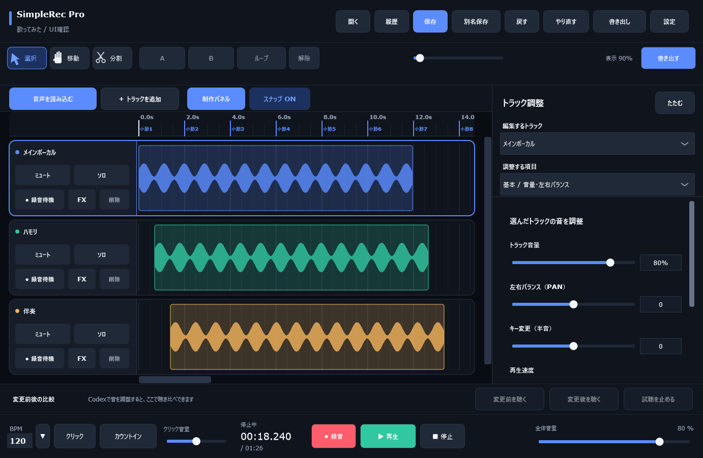

# SimpleRecPro

Windows向けの録音・音声編集アプリケーションです。録音、複数トラックの編集、音質調整、保存、WAV／MP3書き出しを一つの画面で扱えます。MCPを通じて、会話から選択した音声の調整や変更前後の比較も操作できます。

*合成音声を配置して生成したUIテスト画面。*

## 主な機能

- **録音と編集**：複数トラック、録音位置の遅延補正、非破壊トリム、フェード、A-Bループ、Undo／Redo。
- **音作り**：音量・パン・EQ・コンプレッション・ノイズゲート・歯擦音抑制、役割別のMIX提案、参考曲との比較調整。
- **制作支援**：独立したキー／速度変更、BPM候補の解析、テンポ・拍子変更、メトロノーム、リズム編集、ハモリ生成。
- **プラグイン連携**：VST3の検索、複数エフェクトの管理、ARA対応プラグインとの音声・編集状態の連携。
- **保存と出力**：プロジェクトの保存・復元、旧形式の読み込み、全体／選択トラック／範囲のWAV・MP3書き出し。
- **会話からの操作**：選択範囲の音量・明るさ・響きの調整、音声解析、3案の比較、参考曲の指定、好みの保存・再適用。

## コードの構成と検証

- 元の音声を維持した編集と、依頼単位で戻せる操作を組み合わせています。会話で指定された範囲を、勝手にトラック全体へ広げないようにしています。
- UI、音声処理、保存、外部操作の窓口を分けています。音声処理や参考曲の分析はPC内で行い、MCPには選択状態・調整値・測定結果などを返します。
- 保存は一時ファイルを完成させてから置き換えます。旧形式を読み込み、未知の新しい形式は拒否することで、保存データの扱いを明確にしています。
- 外部プラグインの検査失敗、バックグラウンド処理中のプロジェクト変更、操作のタイムアウトなどを考慮しています。
- 合成音声を使う自動テストで、保存往復、Undo／Redo、範囲編集、書き出し、MCPの通信と操作を確認できます。

## 技術構成

| 項目 | 技術 |
| --- | --- |
| アプリ・音声処理 | C++、JUCE 8 |
| プラグイン連携 | VST3、ARA SDK |
| キー／速度変更 | Signalsmith Stretch |
| MP3変換 | FFmpegを別プロセスで実行 |
| 会話からの操作 | Python 3.10以降、MCP STDIO、ローカルファイルIPC |
| ビルド・検証 | CMake、CTest、Python unittest、GitHub Actions |

## コードを読む入口

| 確認したい内容 | 主なファイル |
| --- | --- |
| 画面と操作の組み立て | [MainComponent](Source/MainComponent.cpp)、[StudioPanelComponent](Source/StudioPanelComponent.cpp) |
| 録音・再生・編集・書き出し | [AudioEngine](Source/AudioEngine.h)、[WindowsMp3Encoder](Source/WindowsMp3Encoder.cpp) |
| 保存形式と互換性 | [ProjectSerializer](Source/ProjectSerializer.cpp) |
| MIXの提案と参考曲の解析 | [AutoMixAnalyzer](Source/AutoMixAnalyzer.cpp)、[ReferenceMixAnalyzer](Source/ReferenceMixAnalyzer.cpp) |
| 会話の操作と範囲指定 | [AssistantController](Source/AssistantController.cpp)、[RegionAutomation](Source/RegionAutomation.cpp) |
| MCPとアプリ間の通信 | [simplerecpro_mcp.py](tools/simplerecpro_mcp.py)、[AssistantBridge](Source/AssistantBridge.cpp) |
| 動作検証 | [Tests](Tests)、[MCPテスト](tools/test_simplerecpro_mcp.py)、[操作のE2Eテスト](tools/test_assistant_e2e.py) |

## 動作確認

公開用ソースの確認結果は[検証記録](docs/VALIDATION.md)に記載しています。自動テストと、実機での録音・外部プラグイン・音の聴き比べは区別しています。外部プラグインは別途導入が必要です。

ビルド・テストの手順は[BUILD.md](docs/BUILD.md)、MCPの操作仕様は[CODEX_CONTROL.md](docs/CODEX_CONTROL.md)を参照してください。

## 利用条件

ソースレビュー・私的な評価ビルド向けに掲載しています。利用条件は[LICENSE](LICENSE)、依存ソフトウェアの条件は[LICENSES.md](docs/LICENSES.md)を参照してください。
